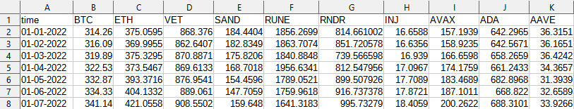

### Portfolio Optimization Application

**This Streamlit-based web application allows users to optimize their investment portfolios using Modern Portfolio Theory (MPT). Here's a breakdown of its key functionalities and features:**

#### Features:

2. **File Upload**:
   - Users can upload a CSV file containing asset price data. The application expects the file to have a date column (`time`) in `MM-DD-YYYY` format and asset price columns in numerical format.
   - Displays an example CSV format to guide users.

4. **Portfolio Optimization Methods**:
   - **Sharpe Ratio Optimization**: Maximizes the Sharpe ratio to optimize the portfolio.
   - **Min Volatility Optimization**: Minimizes the portfolio volatility.

5. **Interactive User Inputs**:
   - Users can select the optimization method (Sharpe or Min Volatility) through a radio button.
   - Adjust the range of weights for the assets using a slider.

6. **Optimization Execution**:
   - Once the user sets the parameters and clicks the "Run optimization" button, the application computes the optimal weights using the selected method.
   - Displays the optimal weights as both a bar chart and a DataFrame.

7. **Portfolio Performance Metrics**:
   - Calculates various performance metrics for the optimized portfolio, including:
     - Cumulative returns
     - Sharpe ratio
     - Sortino ratio
     - Omega ratio
     - Average daily, monthly, and annual volatility
     - Maximum drawdown

This application provides a comprehensive and user-friendly interface for optimizing investment portfolios, making it a valuable tool for both novice and experienced investors.